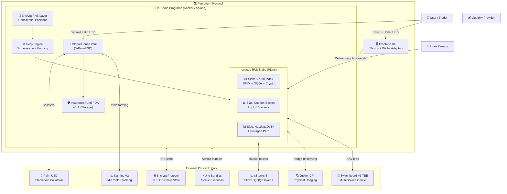
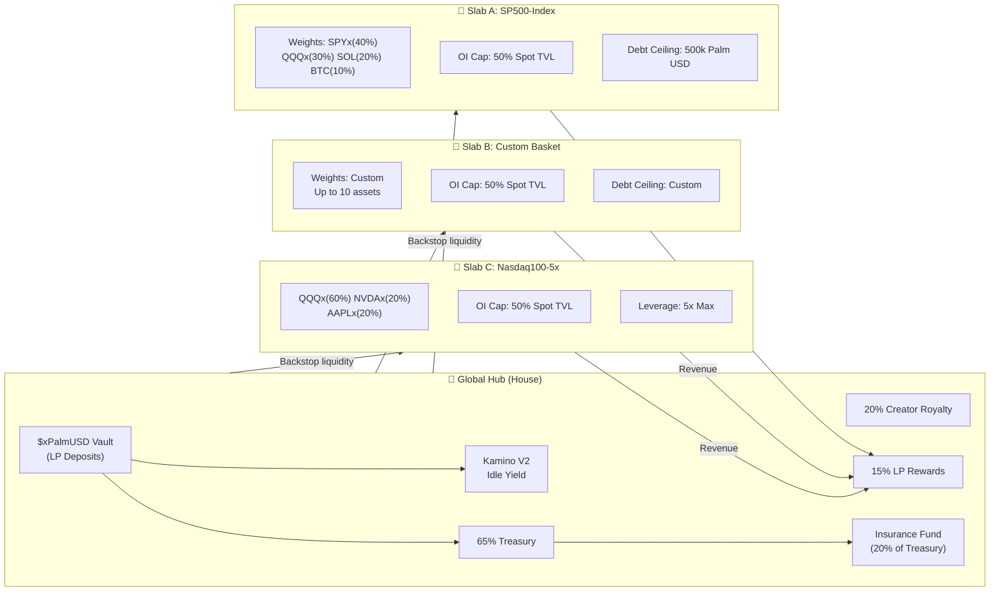
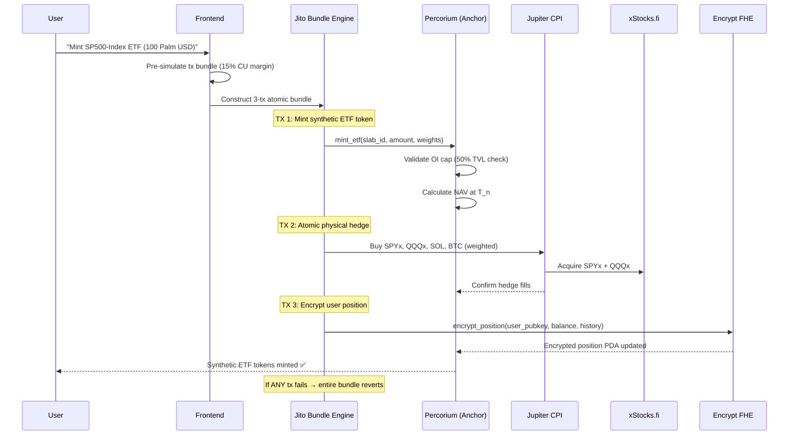
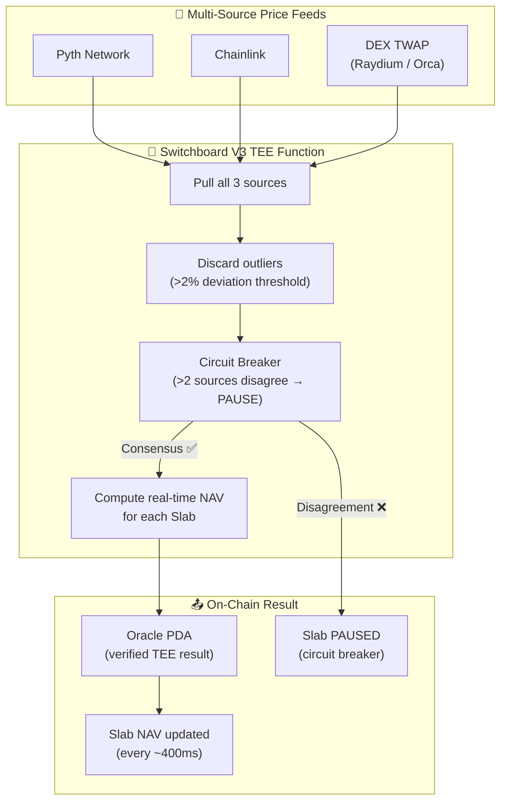
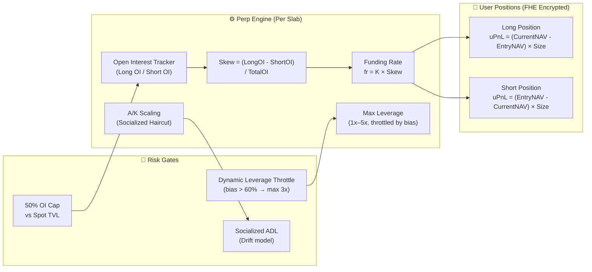
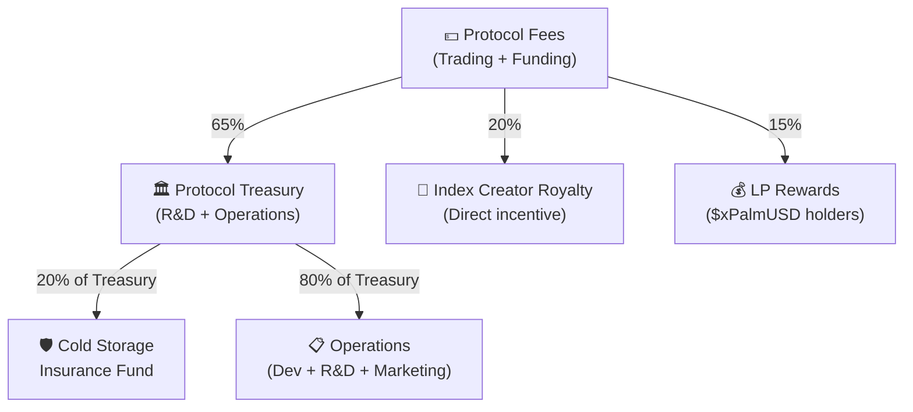
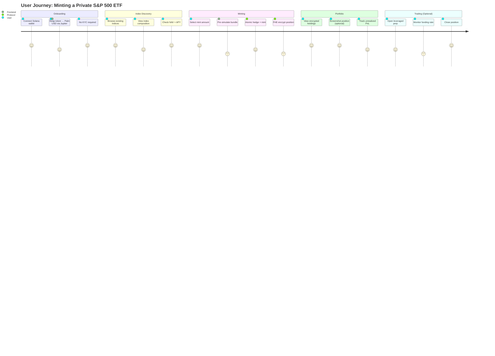

# Percorium 
### The Sovereign On-Chain Layer for Synthetic Indices

> **Percolator** (Solana's financial engine) + **Emporium** (Market) = **Percorium**

[](https://solana.com)
[](https://encrypt.build)
[](https://palmusd.com)
[](https://colosseum.org)
[](LICENSE)
[](https://explorer.solana.com/?cluster=devnet)

---

Percorium is a high-performance financial primitive on Solana that enables the creation, trading, and scaling of **private synthetic indices** and **leveraged perpetual markets**. Users gain exposure to diversified asset baskets — Equities (via xStocks.fi) and Crypto — with 1:1 atomic backing and full portfolio confidentiality powered by Fully Homomorphic Encryption.

**Built for the Colosseum Frontier Hackathon** — targeting the Encrypt FHE + Palm USD Superteam bounty tracks.

---

## Table of Contents

- [Vision](#vision)
- [System Architecture](#system-architecture)
- [Core Features](#core-features)
- [Technical Stack](#technical-stack)
- [Mathematical Foundation](#mathematical-foundation)
- [Risk Management](#risk-management)
- [Revenue & Insurance Model](#revenue--insurance-model)
- [File Structure](#file-structure)
- [Getting Started](#getting-started)
- [Deployment](#deployment)
- [Coming Soon](#coming-soon)
- [Security](#security)
- [Contributing](#contributing)
- [License](#license)

---

## Vision

Percorium exists to solve three problems that no current DeFi protocol addresses simultaneously:

1. **No KYC index exposure** — Retail users cannot access index funds (S&P 500, Nasdaq 100) without submitting to centralised KYC platforms that routinely suffer data breaches. Percorium abstracts this entirely via xStocks.fi's compliant token layer.

2. **MEV-front-running and position leakage** — Whale movements and conviction positions are exposed on-chain, creating front-running opportunities. Percorium encrypts all balances and trade history at the L1 state level via Encrypt Protocol's FHE.

3. **Protocol contagion risk** — Traditional global liquidity pools (like Drift's pre-hack model) create single points of failure. Percorium's Isolated Risk Slabs mathematically sandbox each index's risk.

---

## System Architecture

### High-Level Overview



---

### Hub and Slab Model



---

### Atomic Mint / Hedge Flow



---

### Oracle Engine (TEE NAV)



---

### Perp Engine & Funding Rate



---

### Revenue Flow



---

### User Journey



---

## Core Features

### 1. Synthetic Spot ETFs
Users mint and redeem private index tokens representing a basket of up to **5-10 assets** with 1:1 physical backing. At launch (T₀), each index token is normalised to **1.00 Palm USD**. The NAV floats from there based on the underlying basket performance.

### 2. Leveraged Perpetuals
Up to **5x leverage** on any index, gated by the "Spot-to-Perp TVL ratio." The protocol enforces that perpetual open interest never exceeds 50% of the Spot TVL — the casino never outweighs the investment.

### 3. Atomic Hedging
Every mint or long position is hedged in the **same block** via Jito Bundles. This ensures the protocol is always delta-neutral. If any transaction in the bundle fails, the entire bundle reverts atomically.

### 4. Jupiter Swap Frontend
A dedicated swap module allows users to convert any Solana-based token into Palm USD directly within the Percorium UI — streamlining capital entry without leaving the platform.

### 5. Confidential Portfolios (FHE)
Using Encrypt Protocol's Fully Homomorphic Encryption, all user balances and trade history are encrypted at the L1 state level. Users retain MEV protection and whale position shielding. Positions can be decrypted only by the user's own key.

---

## Technical Stack

| Layer | Technology | Purpose |
|---|---|---|
| **Blockchain** | Solana | High-throughput L1 execution |
| **Smart Contracts** | Anchor 0.30+ | Program framework + PDA management |
| **Stablecoin** | Palm USD | Primary collateral and unit of account |
| **Privacy** | Encrypt Protocol (FHE) | Confidential L1 state for all user data |
| **Atomicity** | Jito Bundles | Sequencing swaps, mints, hedges atomically |
| **DEX Execution** | Jupiter CPI | Physical hedging of underlying assets |
| **Oracle** | Switchboard V3 TEE | Multi-source NAV calculation in secure enclave |
| **Yield** | Kamino V2 | Idle LP capital yield stacking |
| **Equity Tokens** | xStocks.fi | SPYx, QQQx, AAPLx, NVDAx on-chain |
| **Scaling** | Address Lookup Tables | Fitting 10-asset accounts in one tx |
| **Frontend** | Next.js 14 + Tailwind | User-facing interface |
| **Wallet** | Wallet Adapter | Phantom, Backpack, Solflare |

---

## Mathematical Foundation

### I. Net Asset Value (NAV)

$$NAV_t = \sum_{i=1}^{n} \left( w_i \times P_{i,t} \right)$$

Where:
- $w_i$ = weight of asset $i$ in the index (sum of all weights = 1)
- $P_{i,t}$ = price of asset $i$ at time $t$ (sourced from Switchboard TEE)
- At $T_0$: $NAV_{T_0} = 1.00$ Palm USD (normalised)

### II. Unrealized PnL (uPnL) for Perps

$$uPnL = (NAV_{current} - NAV_{entry}) \times size \times leverage$$

For shorts:
$$uPnL_{short} = (NAV_{entry} - NAV_{current}) \times size \times leverage$$

### III. Skew-Based Funding Rate

$$fr = K \times \frac{OI_{long} - OI_{short}}{OI_{long} + OI_{short}}$$

Where:
- $K$ = protocol slope constant (governance-adjustable per slab)
- $fr > 0$: longs pay shorts (market is long-biased)
- $fr < 0$: shorts pay longs (market is short-biased)

### IV. A/K Global Scaling (Socialized Haircuts)

When total payouts exceed the Slab's debt ceiling:

$$Payout_i^{adjusted} = Payout_i \times \frac{DebtCeiling}{TotalPayout}$$

This is the socialized ADL model — proportional haircuts across all profitable positions rather than targeting the most profitable traders (Drift's preferred model, validated post-Hyperliquid comparison).

### V. Dynamic Leverage Throttling

$$MaxLeverage = MaxLeverage_{base} \times \left(1 - \alpha \times |Skew|\right)$$

Where $\alpha$ is the throttle coefficient. At $|Skew| > 0.6$, max leverage is capped at $3x$.

---

## Risk Management

| Mechanism | Description |
|---|---|
| **50% OI Cap** | Perp OI hard-capped at 50% of Spot TVL per slab |
| **Dynamic Leverage Throttling** | Max leverage reduces as market bias increases |
| **A/K Scaling** | Socialized haircuts protect LPs in extreme volatility |
| **24-Hour LP Cooldown** | Withdrawal lock prevents flash-drain and oracle manipulation |
| **Oracle Guardrails** | Multi-source TEE discards outlier feeds beyond deviation threshold |
| **Isolated Risk Slabs** | No cross-slab contagion — each index has independent risk parameters |
| **Circuit Breaker** | Slab auto-paused if >2 oracle sources disagree |
| **Insurance Fund** | 20% of treasury revenue diverted to cold storage backstop |
| **Atomic Hedging** | Delta-neutral at all times via same-block Jito bundle execution |

---

## Revenue & Insurance Model

```
Gross Protocol Revenue
│
├── 65% → Protocol Treasury
│   ├── 80% → Operations (R&D, Scaling, Marketing)
│   └── 20% → Cold Storage Insurance Fund
│
├── 20% → Index Creator Royalty
│   └── Direct incentive for professional analysts
│
└── 15% → LP Rewards ($xPalmUSD holders)
    └── Distributed proportionally to LP share
```

---

## File Structure

Percorium uses a **Monorepo architecture** managed via `pnpm` workspaces. The repository is structured to cleanly separate the on-chain Anchor program, the frontend application, shared types/clients, and documentation.

```
Percorium/
│
├── 📄 README.md                          # This file
├── 📄 CONTEXT.md                         # Builder context and AI prompt guide
├── 📄 SECURITY.md                        # Security policy and bug bounty
├── 📄 LICENSE
├── 📄 package.json                       # Root pnpm workspace config
├── 📄 pnpm-workspace.yaml               # Workspace package declarations
├── 📄 turbo.json                         # Turborepo pipeline config
├── 📄 .gitignore
├── 📄 .env.example                       # Environment variable template
│
├── 📁 programs/                          # Solana Anchor Programs
│   └── 📁 percoria/                      # Main on-chain program
│       ├── 📄 Anchor.toml                # Anchor config (devnet cluster)
│       ├── 📄 Cargo.toml                 # Rust dependencies
│       ├── 📄 Cargo.lock
│       └── 📁 src/
│           ├── 📄 lib.rs                 # Program entrypoint + instruction routing
│           │
│           ├── 📁 state/                 # All on-chain account structs (PDAs)
│           │   ├── 📄 mod.rs
│           │   ├── 📄 global_vault.rs    # GlobalVaultState PDA
│           │   ├── 📄 slab.rs            # SlabAccount PDA (per index)
│           │   ├── 📄 user_position.rs   # UserPosition PDA (FHE encrypted)
│           │   ├── 📄 lp_deposit.rs      # LpDepositAccount PDA (cooldown)
│           │   ├── 📄 insurance_fund.rs  # InsuranceFundAccount PDA
│           │   ├── 📄 oracle_feed.rs     # OracleFeedAccount (Switchboard)
│           │   └── 📄 perp_position.rs   # PerpPositionAccount PDA
│           │
│           ├── 📁 instructions/          # All instruction handlers
│           │   ├── 📄 mod.rs
│           │   │
│           │   ├── 📁 vault/
│           │   │   ├── 📄 mod.rs
│           │   │   ├── 📄 initialize_vault.rs   # Init global house vault
│           │   │   ├── 📄 deposit_lp.rs          # LP deposit + Kamino yield
│           │   │   ├── 📄 withdraw_lp.rs         # LP withdraw (24h cooldown)
│           │   │   └── 📄 harvest_yield.rs       # Kamino yield harvest
│           │   │
│           │   ├── 📁 slab/
│           │   │   ├── 📄 mod.rs
│           │   │   ├── 📄 create_slab.rs         # Create new index slab
│           │   │   ├── 📄 update_slab_config.rs  # Update weights/ceiling
│           │   │   └── 📄 pause_slab.rs          # Emergency circuit breaker
│           │   │
│           │   ├── 📁 etf/
│           │   │   ├── 📄 mod.rs
│           │   │   ├── 📄 mint_etf.rs            # Mint synthetic index token
│           │   │   └── 📄 redeem_etf.rs          # Redeem ETF → Palm USD
│           │   │
│           │   ├── 📁 perp/
│           │   │   ├── 📄 mod.rs
│           │   │   ├── 📄 open_perp.rs           # Open leveraged position
│           │   │   ├── 📄 close_perp.rs          # Close + settle PnL
│           │   │   ├── 📄 settle_funding.rs      # Skew funding rate settlement
│           │   │   └── 📄 liquidate.rs           # Liquidation handler
│           │   │
│           │   ├── 📁 oracle/
│           │   │   ├── 📄 mod.rs
│           │   │   ├── 📄 update_nav.rs          # Consume Switchboard TEE result
│           │   │   └── 📄 request_nav.rs         # Request NAV from oracle
│           │   │
│           │   └── 📁 revenue/
│           │       ├── 📄 mod.rs
│           │       ├── 📄 distribute_revenue.rs  # 65/20/15 split logic
│           │       └── 📄 fund_insurance.rs      # Divert 20% to insurance fund
│           │
│           ├── 📁 math/                   # Pure math library
│           │   ├── 📄 mod.rs
│           │   ├── 📄 nav.rs              # NAV calculation
│           │   ├── 📄 pnl.rs             # uPnL calculation
│           │   ├── 📄 funding.rs         # Skew-based funding rate
│           │   ├── 📄 scaling.rs         # A/K socialized haircut
│           │   └── 📄 leverage.rs        # Dynamic leverage throttle
│           │
│           ├── 📁 cpi/                    # Cross-Program Invocations
│           │   ├── 📄 mod.rs
│           │   ├── 📄 jupiter.rs         # Jupiter swap CPI
│           │   ├── 📄 kamino.rs          # Kamino deposit/withdraw CPI
│           │   └── 📄 encrypt.rs         # Encrypt FHE CPI bindings
│           │
│           └── 📁 errors/
│               └── 📄 mod.rs             # Custom Anchor error codes
│
├── 📁 tests/                             # Anchor test suite (TypeScript)
│   ├── 📄 package.json
│   ├── 📄 tsconfig.json
│   ├── 📁 fixtures/                      # Test data + mock oracle feeds
│   │   ├── 📄 mock_oracle.ts
│   │   └── 📄 mock_palm_usd.ts
│   ├── 📄 01_initialize_vault.test.ts
│   ├── 📄 02_create_slab.test.ts
│   ├── 📄 03_mint_etf.test.ts
│   ├── 📄 04_redeem_etf.test.ts
│   ├── 📄 05_open_perp.test.ts
│   ├── 📄 06_close_perp.test.ts
│   ├── 📄 07_funding_settlement.test.ts
│   ├── 📄 08_lp_deposit_withdraw.test.ts
│   ├── 📄 09_revenue_distribution.test.ts
│   ├── 📄 10_oracle_circuit_breaker.test.ts
│   ├── 📄 11_ak_scaling.test.ts
│   └── 📄 12_bundle_simulation.test.ts
│
├── 📁 apps/
│   └── 📁 web/                           # Next.js 14 Frontend
│       ├── 📄 package.json
│       ├── 📄 next.config.js
│       ├── 📄 tailwind.config.ts
│       ├── 📄 tsconfig.json
│       ├── 📁 public/
│       │   ├── 📄 logo.svg
│       │   └── 📄 favicon.ico
│       └── 📁 src/
│           ├── 📁 app/                   # Next.js App Router
│           │   ├── 📄 layout.tsx
│           │   ├── 📄 page.tsx           # Landing / Dashboard
│           │   ├── 📁 indices/
│           │   │   ├── 📄 page.tsx       # Browse all indices
│           │   │   └── 📁 [slabId]/
│           │   │       └── 📄 page.tsx   # Individual index page
│           │   ├── 📁 create/
│           │   │   └── 📄 page.tsx       # Create new index
│           │   ├── 📁 trade/
│           │   │   └── 📄 page.tsx       # Perp trading interface
│           │   ├── 📁 portfolio/
│           │   │   └── 📄 page.tsx       # Encrypted user portfolio
│           │   └── 📁 earn/
│           │       └── 📄 page.tsx       # LP deposit / earn yield
│           │
│           ├── 📁 components/
│           │   ├── 📁 layout/
│           │   │   ├── 📄 Navbar.tsx
│           │   │   └── 📄 Footer.tsx
│           │   ├── 📁 swap/
│           │   │   └── 📄 JupiterSwapWidget.tsx  # Jupiter → Palm USD
│           │   ├── 📁 index/
│           │   │   ├── 📄 IndexCard.tsx
│           │   │   ├── 📄 IndexComposition.tsx
│           │   │   ├── 📄 MintRedeemPanel.tsx
│           │   │   └── 📄 NAVChart.tsx
│           │   ├── 📁 perp/
│           │   │   ├── 📄 PerpTradePanel.tsx
│           │   │   ├── 📄 RiskMeter.tsx          # Hides "skew" from users
│           │   │   ├── 📄 ExpectedAPY.tsx        # Hides "funding rate"
│           │   │   └── 📄 PositionCard.tsx
│           │   ├── 📁 portfolio/
│           │   │   ├── 📄 EncryptedPortfolio.tsx
│           │   │   └── 📄 PositionHistory.tsx
│           │   ├── 📁 earn/
│           │   │   ├── 📄 LPDepositPanel.tsx
│           │   │   └── 📄 YieldDashboard.tsx
│           │   └── 📁 ui/                        # Shared UI primitives
│           │       ├── 📄 Button.tsx
│           │       ├── 📄 Modal.tsx
│           │       ├── 📄 Toast.tsx
│           │       └── 📄 Badge.tsx
│           │
│           ├── 📁 hooks/
│           │   ├── 📄 usePercorium.ts    # Main protocol hook
│           │   ├── 📄 useSlabs.ts        # Fetch + subscribe to slabs
│           │   ├── 📄 useUserPosition.ts # Decrypt + display user position
│           │   ├── 📄 useNAV.ts          # Real-time NAV feed
│           │   └── 📄 useJitoBundle.ts   # Bundle simulation + submission
│           │
│           └── 📁 lib/
│               ├── 📄 anchor-client.ts   # Anchor IDL + provider setup
│               ├── 📄 constants.ts       # Program IDs, PDAs, mint addresses
│               └── 📄 utils.ts           # Formatting helpers
│
├── 📁 packages/
│   ├── 📁 sdk/                           # Percorium TypeScript SDK
│   │   ├── 📄 package.json
│   │   ├── 📄 tsconfig.json
│   │   ├── 📁 src/
│   │   │   ├── 📄 index.ts
│   │   │   ├── 📄 client.ts             # PercoriumClient class
│   │   │   ├── 📁 instructions/         # Instruction builders
│   │   │   │   ├── 📄 vault.ts
│   │   │   │   ├── 📄 slab.ts
│   │   │   │   ├── 📄 etf.ts
│   │   │   │   └── 📄 perp.ts
│   │   │   ├── 📁 types/                # Shared TypeScript types
│   │   │   │   └── 📄 index.ts
│   │   │   └── 📄 idl.ts                # Auto-generated Anchor IDL types
│   │   └── 📄 README.md
│   │
│   ├── 📁 jito-client/                   # Jito bundle client
│   │   ├── 📄 package.json
│   │   └── 📁 src/
│   │       ├── 📄 index.ts
│   │       ├── 📄 bundle.ts             # Bundle construction + simulation
│   │       └── 📄 optimize.ts           # CU optimization logic
│   │
│   └── 📁 oracle-client/                 # Switchboard oracle client
│       ├── 📄 package.json
│       └── 📁 src/
│           ├── 📄 index.ts
│           ├── 📄 switchboard.ts        # TEE function requests
│           └── 📄 feeds.ts              # Pyth + Chainlink feed addresses
│
├── 📁 scripts/                           # Deployment + admin scripts
│   ├── 📄 deploy-devnet.sh
│   ├── 📄 initialize-vault.ts
│   ├── 📄 create-sample-slabs.ts        # Seed SP500 + Nasdaq100 slabs
│   ├── 📄 setup-luts.ts                 # Address Lookup Table setup
│   └── 📄 verify-deploy.ts
│
├── 📁 docs/                              # Additional documentation
│   ├── 📄 ARCHITECTURE.md
│   ├── 📄 MATH.md                       # Full mathematical proofs
│   ├── 📄 CU_OPTIMIZATION.md           # Bundle + compute unit guide
│   ├── 📄 ORACLE_GUIDE.md              # Switchboard TEE setup
│   └── 📁 colosseum/
│       ├── 📄 SUBMISSION.md             # Colosseum submission writeup
│       └── 📄 BOUNTY_ALIGNMENT.md      # Encrypt + Palm USD bounty notes
│
└── 📁 .github/
    ├── 📁 workflows/
    │   ├── 📄 test.yml                  # CI: run Anchor tests on push
    │   └── 📄 lint.yml                  # CI: Clippy + ESLint
    └── 📄 PULL_REQUEST_TEMPLATE.md
```

---

## Getting Started

### Prerequisites

- Node.js v20+
- pnpm v9+
- Rust + Cargo (stable)
- Solana CLI v1.18+
- Anchor CLI v0.30+

### Installation

```bash
# Clone the repo
git clone https://github.com/thetruesammyjay/Percorium.git
cd Percorium

# Install all workspace dependencies
pnpm install

# Build the Anchor program
cd programs/percoria
anchor build

# Run the test suite
anchor test
```

### Environment Setup

```bash
cp .env.example .env
```

Required environment variables:

```env
# Solana
ANCHOR_PROVIDER_URL=https://api.devnet.solana.com
ANCHOR_WALLET=~/.config/solana/id.json

# Palm USD Devnet Mint
PALM_USD_MINT=<palm_usd_devnet_mint_address>

# xStocks.fi Token Mints (Devnet)
SPYX_MINT=<spyx_devnet_mint>
QQQX_MINT=<qqqx_devnet_mint>
AAPLX_MINT=<aaplx_devnet_mint>
NVDAX_MINT=<nvdax_devnet_mint>

# Switchboard
SWITCHBOARD_FUNCTION_PUBKEY=<your_deployed_switchboard_function>

# Jito
JITO_BLOCK_ENGINE_URL=https://ny.mainnet.block-engine.jito.wtf
```

---

## Deployment

### Deploy to Devnet (Solana Playground / CLI)

```bash
# Airdrop SOL for deployment
solana airdrop 2 --url devnet

# Build and deploy
anchor build
anchor deploy --provider.cluster devnet

# Initialize the Global House Vault
pnpm run scripts:initialize-vault

# Create sample slabs (SP500-Index + Nasdaq100-5x)
pnpm run scripts:create-sample-slabs

# Set up Address Lookup Tables for 10-asset indices
pnpm run scripts:setup-luts
```

### Frontend (Local Dev)

```bash
cd apps/web
pnpm dev
# → http://localhost:3000
```

---

## Coming Soon

### 🗣️ Token-Gated Conviction Forums
Private social discussion layers embedded at the footer of every index page. Access is gated by holding that specific index token. Holders share research, conviction, and alpha. No Discord. No leaks. On-chain identity, encrypted discussion, zero data harvesting.

### 🏦 Isolated Lending & Borrowing
Borrow Palm USD against your synthetic ETF position at **60% LTV**. Your ETF stays in the protocol earning NAV appreciation while you deploy the borrowed capital elsewhere. No liquidation cascades — each Slab's debt is isolated.

### ⚖️ Delta-Neutral Yield Vaults
Automated yield vaults that simultaneously long the Spot ETF and short the perpetual on the same index. The position is price-neutral (delta = 0) while harvesting funding rates from skewed markets. Pure yield, zero directional risk.

### 🔓 Fully Permissionless Slab Creation
Any user will be able to deploy a new Slab PDA with custom asset weights, debt ceilings, and OI caps — no team gate. The protocol becomes a sovereign factory for custom on-chain indices. The "Sovereign" part of the vision, fully realised.

### 📱 Mainnet Migration
Full audit → bug bounty → mainnet deployment. Token launch to bootstrap liquidity and governance. Community-governed protocol parameters (K constant, OI caps, revenue split).

---

## Security

Security is a first-class concern in Percorium. Given the protocol handles real capital and leveraged positions, the following mechanisms are implemented:

- **Reentrancy Guards** — All state-modifying instructions are protected against reentrancy via Anchor's account constraints.
- **CPI Signer Checks** — All cross-program invocations (Jupiter, Kamino, Encrypt) verify the signing PDA matches expected seeds.
- **FHE Invariants** — User positions are never stored or emitted in plaintext. The Encrypt protocol enforces this at the cryptographic level.
- **Bundle Simulation** — All Jito bundles are pre-simulated with exact account lists and CU limits before submission. Failed bundles revert atomically.
- **Oracle Guardrails** — TEE-enforced multi-source NAV with circuit breakers and deviation thresholds prevent oracle manipulation.
- **24h LP Cooldown** — Protects against flash-drain attacks targeting the Global House Vault.
- **50% OI Hard Cap** — Prevents the perpetual book from exceeding the physically-backed spot TVL.
- **Insurance Fund** — Cold storage backstop funded by 20% of treasury revenue.

For vulnerabilities, see [SECURITY.md](SECURITY.md).

> **Regulatory Note:** Percorium offers synthetic price exposure only. Users receive delta exposure to the underlying basket, not ownership, voting rights, or dividends. xStocks.fi handles the compliant RWA token layer. Users are not required to KYC at the Percorium protocol level.

---

## Contributing

This is currently a hackathon project (Colosseum Frontier 2026). Post-hackathon contribution guidelines will be published with the mainnet roadmap.

---

## Built With ❤️ For

- **Colosseum Frontier Hackathon 2026**
- **Superteam Bounty Tracks:** Encrypt FHE + Palm USD
- **Vision:** Bringing the S&P 500 and Nasdaq 100 on-chain — privately, atomically, for everyone.

---

## License

MIT © 2026 Percorium / thetruesammyjay